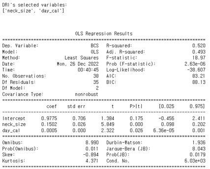

# 반려견 비만 분류 모델링
- Team: Petstival
- Memeber: Donghyun Son (Leader), Narin Kim
- While: 2022.12.14 - 2022.12.28

## Data
- Produced by Innogrid (http://hackathon-innogrid.com/)
- 12,731 json file data, 12,731 image file data
- 728 dogs, 11 cats

## Role

- Narin Kim

    - Handle Whole Image Classification Process (image.ipynb, image1.ipynb, image2.ipynb, eda_idea.ipynb)
    - Suggest Clustering Idea and pet-cluster-care-service 

- Donghyun Son (Leader)

    - Make the flow of our analysis
    - 논문 조사 : 비만관련 근거 수집 및 강아지 비만 관련 논문 조사
    - 전처리 : 나이, 체중 결측 및 이상치 보유한 강아지 이미지 등 확인 후 제거
    - 상관관계 분석 : 강아지 품종별 신체정보와 BCS 지수 사이의 상관관계 확인
    - 회귀모형 모델링 : 모델링 및 변수 선택 진행
    - 피처 생성 : 분류모형에 활용할 피처 아이디어 제안 및 피처 생성
    - 분류 모형 모델링 : 분류 모형을 위한 피처 선정 및 모델 훈련
    - PPT 자료 취합 및 작성
    - 프로젝트 서기 : 노션 회의, 분석 내용 정리

## 프로젝트 배경

- 전세계 반려견의 비만률은 지난 10년간 158% 증가하는 추세
- 반려동물의 신체 비만을 측정하는 BCS 지수는 전문가가 주관적으로 부여하는 지수로 보호자들이 비만 여부를 쉽게 판단하기 어려움
- BCS 지수를 보완하고 대체할 수 있는 비만 분류 모형을 만들어 반려동물 비만에 대한 인식을 고취시키고자 함

## 데이터 셋

- 반려견, 반려묘 건강정보 데이터 (2022)
    
    출처 - 이노그리드 제공
    
    크기 - 728마리 강아지, 11마리 고양이에 대한 12,731 json file, 12,731 image file
    
    특징
    
    - json data : 강아지에 대한 신체 및 질병 정보 (중복 O)
    - image : 강아지 한 마리를 여러 각도에서 찍은 이미지

## 기술 스택

    
    
    
    
    

## 프로젝트 진행 단계

1. EDA 및 분석 과제 결정
2. 데이터 전처리
3. 상관관계 분석
4. 피처 엔지니어링
5. 회귀모형 생성
6. 분류 모형 모델링
7. 이미지 분류 전처리
8. 이미지 분류 모델링
9. 활용방안 도출
10. 결과 정리 및 보고 PPT 작성

## 프로젝트 세부 과정

1. EDA 및 분석 과제 결정
    
    신체정보를 기반으로 강아지 품종별로 체중, 나이, 식이, 식사량 변수 등을 활용해서 BCS 지수와의 관계성을 파악
    
    → 비만 분류 모형에 활용할 수 있음을 확인
    
    > 기존의 BCS 지수를 대체하는 비만을 판단할 수 있는 비만 분류 모형을 만들어 비만관리에 활용하자
    > 

2. 데이터 전처리
    1. json file이 한 강아지에 대해 중복된 정보를 담고 있어, 중복된 행은 제거
    2. **Problem 1** : 품종별로 비만에 대한 기준이 달라 신체정보만으로 비만 분류가 어려운 문제
        
        → 품종별 모델링을 진행하는 것이 맞다고 판단
        
        품종별 표본 수 편차가 커서 모든 품종을 모델링하기보다 적절한 품종을 선정하여 대표적인 모델링을 진행하기로 결정
        
        표본 수가 38마리로 적당한 품종인 시츄를 대표 모델링 품종으로 선정
        
    3. **Problem 2** : 데이터의 문제점 (Human error)
        1. 같은 강아지인데 품종이 다르게 적혀있는 json data가 1마리 존재했음
            
            → 다수의 json file 중에서 한 파일에 대해서만 ‘치와와’로 적혀있고, 나머지 json file에서는 ‘믹스’ 품종으로 분류되어 있어서 ‘치와와’로 분류되어 있는 행을 ‘믹스’로 수정
            
        2. 같은 강아지인데 BCS가 다르게 적힌 강아지가 11마리 존재했음
            
            → 한 강아지에 대해서 두 가지 BCS를 가진 경우 json file 중에서 더 많이 입력된 BCS 값을 선택해서 단일화 처리함
            
        3. 나이 변수가 0살인 강아지 19마리
            
            → 체중으로 짐작을 했을 때, 갓 태어난 강아지의 체중은 아닌 것으로 판단
            
            → 이미지 데이터도 찾아서 판단한 결과, 강아지 신체 서류가 함께 찍혀있는 경우를 제외하고는 나이 유추가 불가능
            
            해당 강아지는 나이를 입력하고 나머지 강아지는 삭제하기로 결정
            
        4. 이상치 데이터
            - 체중이 0인 행
            - 식사량이 과도하게 많이 기록된 행
            
            위 행들은 기록 상 착오라고 판단되어 삭제 처리
            

3. 상관관계 분석
    
    BCS와 상관관계가 높은 변수를 이용하여 비만 분류 모형에 사용하고자 상관분석 진행
    
    체중, 목 둘레, 흉곽 둘레 변수와 BCS 변수 사이의 강한 양의 상관관계를 확인
    

4. 피처 엔지니어링
    
    주어진 신체, 식이 변수를 활용해 6개 피처 생성
    
    - day_food_amount (하루 식사량) = (food-amount  * food-count + food-amount * snack-amount * 0.01)
    (snack-amount는 데이터 설명에 의하면, food-amount 대비 퍼센트를 정수형으로 나타냄)
    - day_cal (하루 섭취 칼로리량) = day_food_amount * 300
    - RER (휴식 에너지 요구량) = 70 * 체중^(0.75)
    - DER (일일 에너지 요구량) = (강아지 상태) * RER
    - cal_diff (초과 칼로리) = day_cal - DER
    - over_weight (과체중 변수) = 체중 - 체중 * 100 / (100 + (BCS - 5) * 10)

5. 회귀모형 생성
    - BCS 지수를 종속변수로 시츄에 대한 회귀분석 변수 선택 결과 : 일일 칼로리 섭취량, 목 둘레 변수가 선택됨
        
        
        

6. 분류 모형 모델링
    - **Problem 3** : 비만 변수 선정 문제
        
        BCS 지수의 어느 지점부터를 비만이라고 해야하는가 판단이 어려움
        
        → 연구 자료 조사 진행 
        
        전문가 의견을 근거로 BCS 지수 5를 초과하면 1, 5 이하이면 0으로 라벨링한 ‘fat’ 변수 생성하여 타겟 변수로 사용
        
        
        
    - 분류 모형 생성: 랜덤포레스트
    - 그리드 서치 진행
        - 트리 개수, 트리 최대 깊이, 리프노드의 최소 표본, 분할 샘플 수 등을 세분화하여 실험
    - 분류 정확도 확인
        
        그리드 서치 결과 분류 정확도가 높은 최적 하이퍼파라미터 선택
        
        - Validation Accuracy : 0.833
        - max_depth = 1
        - min_samples_leaf = 4
        - min_samples_split = 2
        - n_estimators = 10
    - 변수 중요도 확인 : 흉곽둘레, 나이, 등 길이, 하루 섭취 칼로리, 목 둘레가 비만 분류에 영향을 미치는 중요한 변수로 확인됨

7. 이미지 분류 전처리 (다른 팀원이 메인으로 진행)
    - Resize : 이미지를 모두 224 * 224로 resizing
    - Data Augmentation
        
        과적합 방지 및 표본 수를 위한 데이터 증강 기법 활용
        
        - Vertical Flip : 이미지 상하 반전
        - Cutout : 이미지 일부분을 0으로 마스킹
    - 인스턴스 러닝 : 동일한 강아지를 여러 각도에서 찍은 사진을 하나의 input으로 학습
        
        동일한 강아지는 동일한 label을 가짐
        
    
8. 이미지 분류 모델링 (다른 팀원이 메인으로 진행)
    - 전이학습 활용 : 데이터 수가 적은 편이라 Large dataset으로 사전에 학습된 모델 파라미터를 가져와 학습에 적용
    - Optimizer = Adam
    - epoch = 25
    - batch size = 64 / 128
    - loss function = Cross Entropy Loss
    - Learning rate = 0.001
    - Scheduler = Exponential LR
    - Pretrained model = {ResNet18, ResNet 34, Vgg16, AlexNet, EfficientNet-B0, Inception V2}
    - 이미지 모델링 결과 : Resnet18의 전이학습 모형의 Accuracy가 97.4%로 추후 테스트 이미지 셋에 적용하고자 함

9. 활용방안 도출
    - 머신러닝을 활용한 비만 분류 모형과 이미지 분류 모형의 가중 모형을 사용하여 할 것을 제안
    1. 비만 진단 서비스
        
        반려동물 사진을 찍고, 간단한 신체, 식사 정보를 입력하여 비만 여부를 진단하는 서비스 모델링
        
        
        
    2. 케어군 제안 서비스
        
        신체정보를 활용한 k-means clustering 모형을 생성하고, 신체정보를 활용해 예상 클러스터를 예측
        
        저체중군/정상군/비만군 각각의 클러스터에 해당하는 반려견에게 적절한 케어 방안 제안
        
        
        

10. 결과 정리 및 보고 PPT 작성
    - PPT 템플릿 작성, PPT 자료 취합 및 내용 작성
    

## 프로젝트 결과

1. 반려견 비만 분류 모형을 생성하여 신체정보와 이미지 정보를 기반으로 한 분류 가능성을 확인
2. 클러스터링을 통한 비만군 판단 진행했을 떄, 흉곽둘레, 일일 섭취 칼로리량 변수와 비만군의 상관관계 확인
3. 품종별로 충분한 데이터를 확보하여 품종별 비만 분류 모형을 생성하여 서비스 확대 가능성 확인
- 대회 최우수상 수상
    
## 프로젝트 회고

1. 잘한 점
    1. 해커톤 대회로 기간이 일주일로 짧게 주어졌는데, 대회 데이터가 초반에 부족하게 주어지는 문제가 있었음
        
        이를 해결하고자 주최 측에 적극적으로 연락을 취하여 문제를 알리고 데이터를 받아냄
        
    2. 시간 부족 문제 해결 방안
        
        시간이 부족할 것을 고려하여 주어진 적은 데이터로도 미리 변수에 대한 파악을 진행하고 모델링까지 시도하여 분석 프로세스를 구상함
        
        그 덕분에 실제 분석과 ppt 작성까지 기간이 사흘 정도로 짧았음에도 비만 분류 모델링을 성공적으로 진행함
        

2. 한계점
    1. 주어진 시간이 짧아 모든 품종에 대한 모델링을 진행하지 못함
        
        → 해커톤 대회의 한계로 시간이 더 주어진다면 충분히 모델링 가능할 것으로 사료됨
        
    2. 데이터의 한계점
        
        → 주어진 데이터가 비교적 적은 편이었지만, 추후 실제 데이터가 많이 쌓이면 해결될 것
        
        다만, 데이터 라벨링 관련 문제와 같은 Human error는 추후 데이터가 많이 확보될 경우 더 자주 발생할 수 있는 문제로 이를 해결하기 위해 적절한 MLops 방안을 고려해보면 좋을 것

# Further Description
- Follow link below:
- (https://thon-profile.notion.site/Project-2022-ef18268ca2564e91b06d8efd39cc0e50)